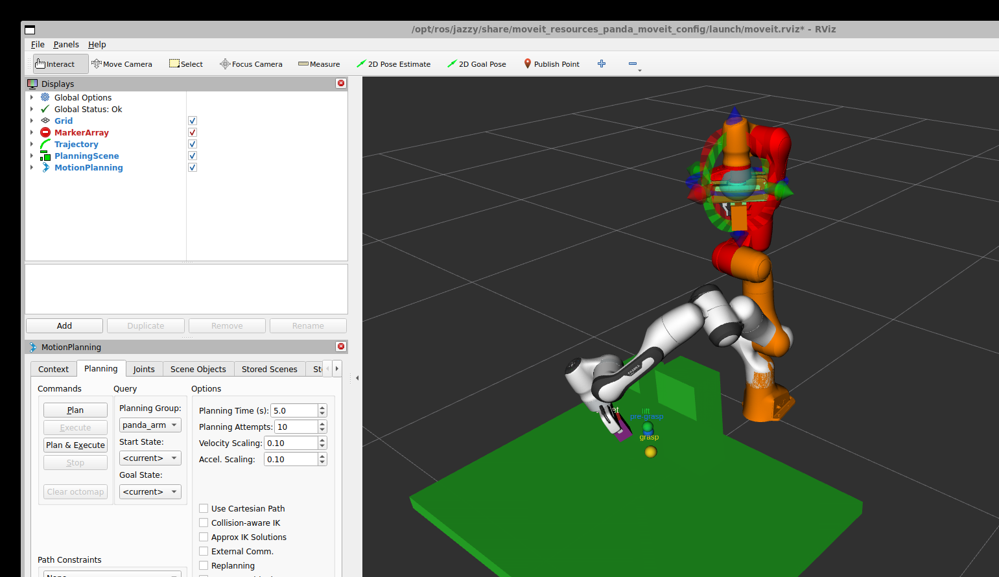
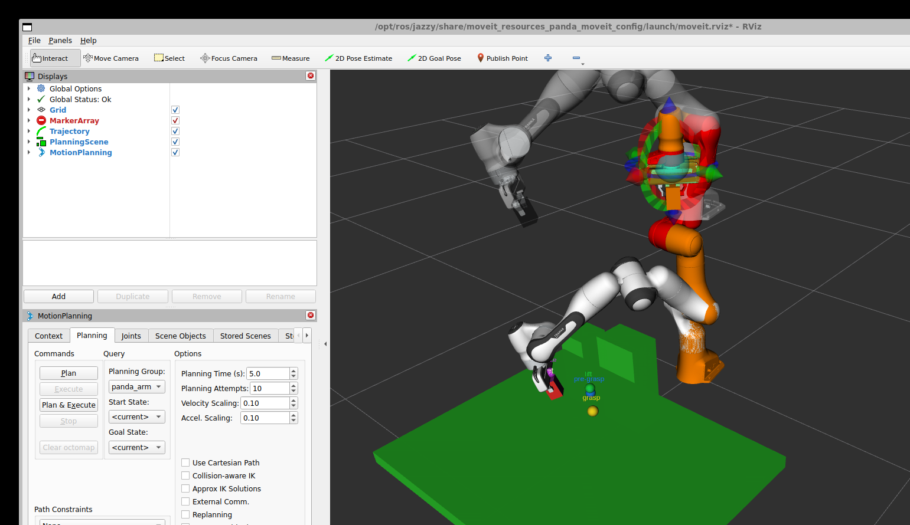
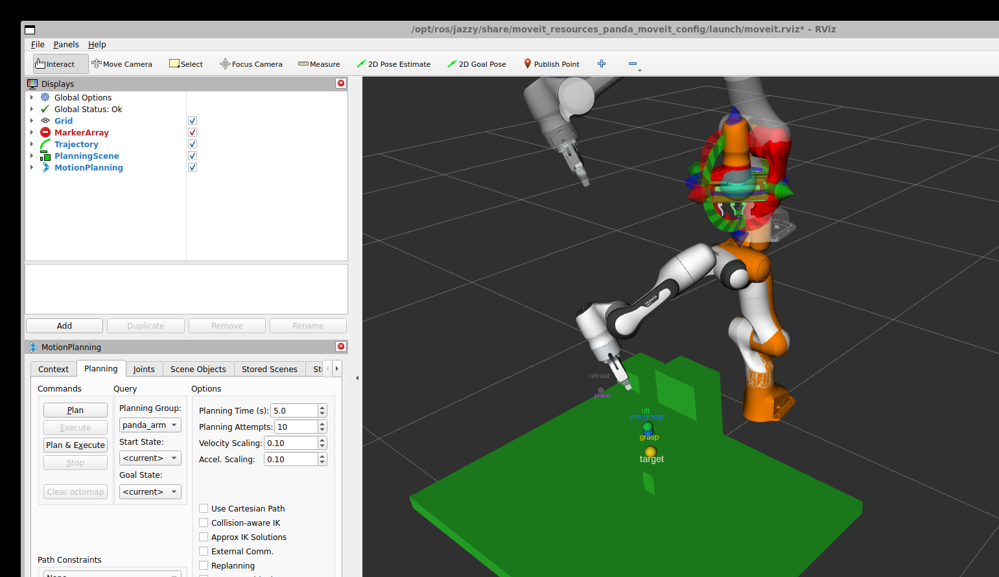
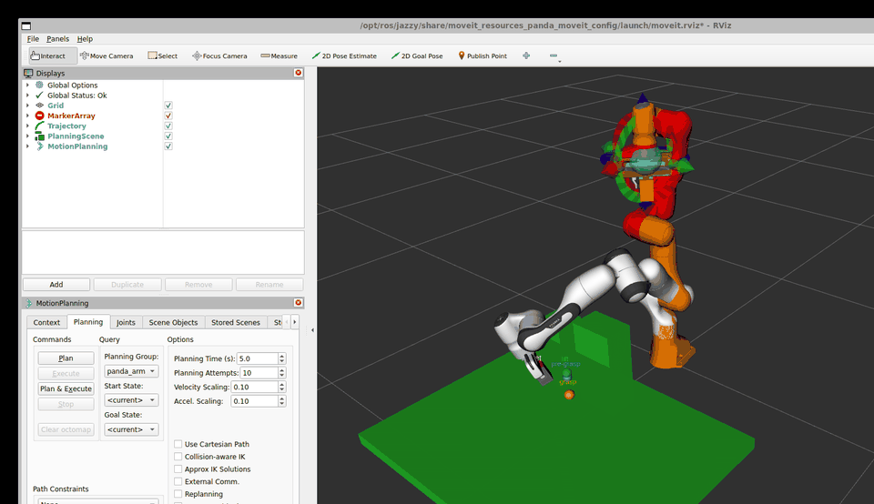
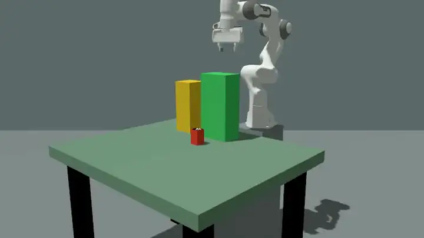
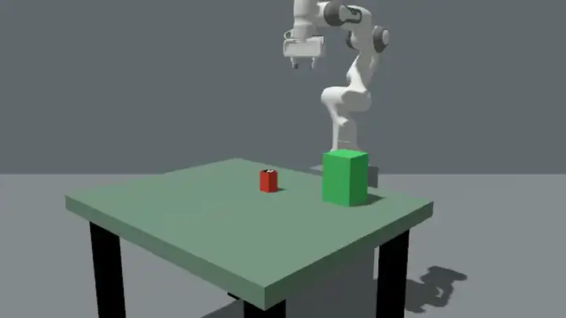
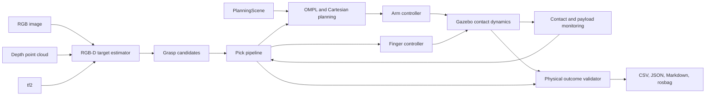
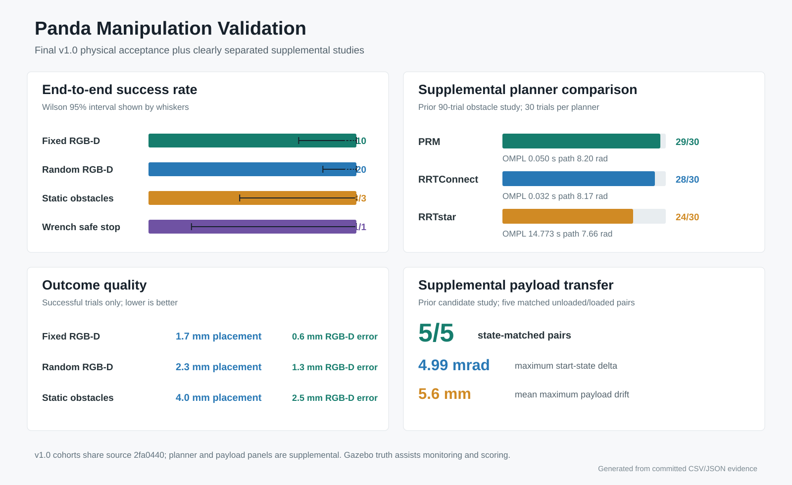
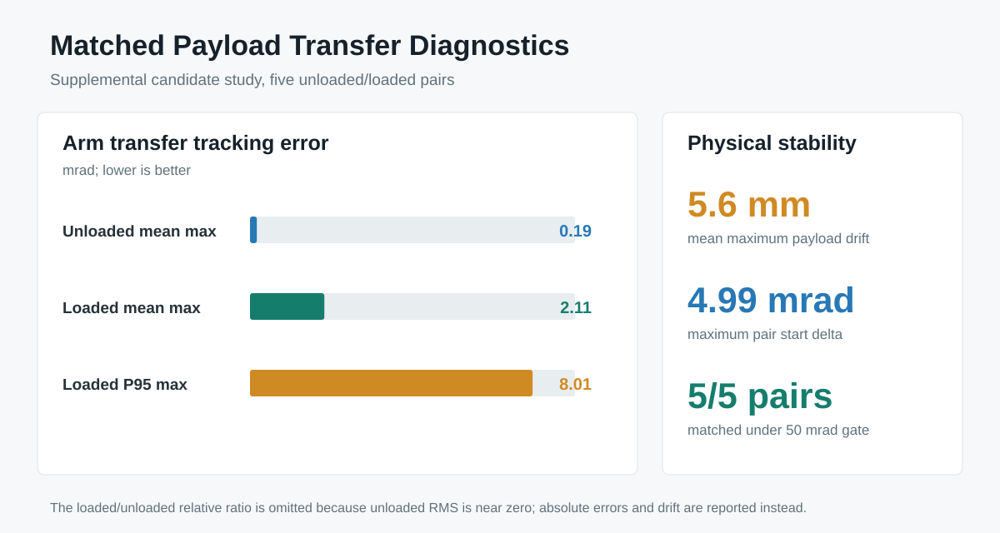

[](README.md) [](README.zh-CN.md)
[](https://github.com/0216Feng/panda-rgbd-manipulation/actions/workflows/ros2-ci.yml)

# Panda RGB-D Manipulation

A reproducible ROS2 Jazzy, MoveIt2, ros2_control, and Gazebo Harmonic project for
collision-aware Franka Panda pick-and-place. The system combines RGB-D target
localization, grasp generation, OMPL global planning, Cartesian contact-zone
motion, two-finger physical grasping, recovery logic, and automated physical
validation.

This repository is a simulation portfolio project for manipulation-planning
roles. It does not claim real-robot deployment or industrial safety validation.

## Highlights

- Markerless RGB-D target localization from RGB segmentation and depth clusters.
- PlanningScene collision geometry with RRTConnect, PRM, and RRTstar support.
- Hybrid OMPL and Cartesian execution with measured-state replanning.
- Independent ros2_control arm and synchronized two-finger controllers.
- Gazebo contact-based grasping, payload-drift monitoring, upright placement,
  retreat, and return-home verification.
- Static and dynamic obstacle experiments, structured failure reasons, CSV/JSON
  reports, rosbag capture, and source/configuration fingerprints.
- Docker/devcontainer setup and GitHub Actions software checks.

## Actual Run

The frames below come from one fresh-world RGB-D obstacle run executed on the
current source tree. They show the live RViz view backed by Gazebo Harmonic
contact simulation, not prerecorded animation or real-robot footage.

| Pre-grasp scene and target estimate | Physical grasp and lift | Collision-aware transfer trail |
| --- | --- | --- |
|  |  |  |



The captured run passed independent physical validation: `0.126 m` lift,
`4.1 mm` placement error, `0.00 deg` final tilt, and a blocked direct path that
required collision-aware planning. See the
[capture provenance and exact command](docs/assets/demo/README.md).

### Gazebo Physical Pick-and-Place

[](docs/assets/demo/gazebo_obstacle_pick.mp4?raw=1)

The complete 38.2-second preview plays inline on the GitHub README. Select it
to open the original 960x540 H.264 video.

This opposite-side Gazebo sensor view shows a separate fresh-world run from
pre-grasp through physical lift, obstacle-aware transfer, upright release,
retreat, and return. Its independent validator measured `0.457 m` maximum
lift, `11.5 mm` placement error, `0.00 deg` final tilt, and confirmed that the
direct collision-aware path was blocked. The clip is 2x playback of the uncut
76.2-second camera stream; it is simulation footage, not a rendered animation
or real-robot recording.

### Injected Safe Stop

[](docs/assets/demo/gazebo_safe_stop.mp4?raw=1)

The complete 13.8-second preview also plays inline; select it for the original
H.264 video.

This separate 13.8-second H.264 clip shows an intentional safety failure. A
bounded `16 N`, `100 ms` Gazebo wrench was applied during Servo descent; the
payload/contact watchdog stopped the matching stage and published a zero
command in `107.8 ms`, below the `200 ms` gate. The pick pipeline correctly
ended in `FAILED`, while the strict independent verdict was `SAFE_STOP_PASS`.
See the [source-bound evidence](artifacts/baselines/v1_candidate_20260913/safe_stop_video/README.md).

## System



The detailed component and trust-boundary description is in
[docs/release_architecture.md](docs/release_architecture.md).

## Evidence

The final `v1.0` acceptance matrix ran from one frozen source snapshot
(`2fa0440`) in fresh Gazebo worlds. Every attempt remains in its denominator.

| Evidence set | Result | What it establishes |
| --- | ---: | --- |
| Final fixed RGB-D | 10/10 (100%) | Repeatable markerless perception and physical pick-and-place |
| Final seeded-random RGB-D | 20/20 (100%) | Target-position variation with mean `1.29 mm` perception error |
| Final representative obstacles | 3/3 (100%) | Three barriers; direct paths blocked and collision-aware transfer verified |
| Final Gazebo wrench safe stop | 1/1 | `16 N`, `100 ms` injection stopped motion in `171.21 ms` under the `200 ms` gate |

Successful final runs averaged `0.55/1.29/2.49 mm` perception error and
`1.74/2.35/4.02 mm` placement error for fixed, random, and obstacle cohorts.
The full software regression passed `318/318`, and source fingerprints were
consistent across all physical cohorts.

The earlier 90-trial three-planner comparison and five-pair loaded/unloaded
transfer study remain useful supplemental experiments. They are versioned and
are not pooled with the final acceptance matrix.

- [Final v1.0 evidence and methodology](artifacts/baselines/v1.0.0/README.md)
- [Final machine-readable verdict](artifacts/baselines/v1.0.0/release_summary.json)
- [Archived 90-trial obstacle report](artifacts/baselines/gazebo_obstacle_90_trials.md)
- [Supplemental paired payload report](artifacts/baselines/v1_candidate_20260910/payload_transfer_paired5/report.md)
- [Release status and claim boundaries](docs/github_release_readiness.md)





## Quick Start

Supported host: Ubuntu 24.04 or WSL2 Ubuntu 24.04 with ROS2 Jazzy. Run these
commands from the repository root:

```bash
source /opt/ros/jazzy/setup.bash
WORKSPACE_DIR="$PWD" bash scripts/setup_wsl_ros2_jazzy.sh
source install/setup.bash
SKIP_PHYSICAL=1 bash scripts/run_release_candidate_validation.sh
bash scripts/run_rgbd_markerless_pick.sh
```

The final command opens the RGB-D pick demo. On WSL2, WSLg must be available for
RViz/Gazebo windows. The setup script installs project dependencies but does not
modify shell startup files.

For a headless installed-graph smoke:

```bash
python3 scripts/check_ros_graph_smoke.py --timeout-s 45
```

For a persistent RGB-D point-cloud view:

```bash
bash scripts/run_rgbd_visualization.sh
```

For one fresh-world physical benchmark:

```bash
mkdir -p artifacts/runs/rgbd_smoke
python3 scripts/run_gazebo_physics_benchmark.py \
  --trials 1 --rgbd-perception --timeout-s 300 \
  --csv artifacts/runs/rgbd_smoke/results.csv \
  --markdown artifacts/runs/rgbd_smoke/report.md \
  --log-dir artifacts/runs/rgbd_smoke/logs
```

See [docs/reproduction.md](docs/reproduction.md) for native, Docker,
devcontainer, and CI instructions.

After freezing a clean commit, run the complete v1.0 physical release gate with:

```bash
bash scripts/run_v1_release_validation.sh
```

Use `V1_PROFILE=smoke` first while changing release infrastructure. Smoke
results verify the runner only and are never promoted to v1.0 reliability
claims.

## Visual Demonstration

The recommended recording path is the markerless RGB-D demo, followed by one
static-barrier case and one injected safe-stop case. A shot list and the exact
commands are in [docs/demo_script.md](docs/demo_script.md). Generated charts are
kept with their CSV and configuration evidence; development logs and rosbags are
excluded from Git. Refresh or verify the portfolio charts with:

```bash
python3 scripts/generate_portfolio_assets.py
python3 scripts/generate_portfolio_assets.py --check
```

Record a clean third-person Gazebo camera stream together with its physical
benchmark evidence using:

```bash
bash scripts/run_gazebo_camera_video.sh
```

## Benchmark Entry Points

```bash
# Fixed or randomized RGB-D physical trials
python3 scripts/run_gazebo_physics_benchmark.py --trials 10 --rgbd-perception
python3 scripts/run_gazebo_physics_benchmark.py \
  --trials 20 --rgbd-perception --randomize-target --seed 42

# Static obstacle planner/scenario matrix
python3 scripts/run_gazebo_physics_benchmark.py \
  --trials 3 --challenge-obstacles --planner-suite

# Dynamic RGB-D obstacle cancellation and replanning
python3 scripts/run_dynamic_replanning_benchmark.py \
  --trials 3 --planner-suite --scenario-suite --timeout-s 240

# Matched unloaded/loaded transfer diagnostics
python3 scripts/run_payload_transfer_diagnostics.py \
  --runs-per-mode 5 --modes unloaded loaded \
  --output-dir artifacts/runs/payload_transfer_paired5
```

Benchmark runners write machine-readable results and preserve source/config
fingerprints. Existing checkpoints require explicit resume flags and reject
incompatible arguments or source revisions.

## Repository Layout

```text
.
|-- src/panda_manipulation/
|   |-- panda_manipulation/   # ROS2 nodes and planning/execution logic
|   |-- launch/               # demos, benchmarks, Gazebo and MoveIt startup
|   |-- config/               # planners, controllers, Servo and RViz profiles
|   |-- urdf/                 # Panda simulation model override
|   |-- worlds/               # Gazebo task worlds
|   `-- test/                 # unit and regression tests
|-- scripts/                  # setup, smoke tests and experiment runners
|-- artifacts/baselines/      # compact public CSV/report/config evidence
|-- docs/                     # architecture, validation and technical roadmap
|-- Dockerfile
`-- .github/workflows/ros2-ci.yml
```

## Validation Scope

Software validation currently contains 318 passing package tests in the
maintainer's ROS2 Jazzy environment. The prepared GitHub workflow builds the
Docker image, runs software checks, and verifies the installed synthetic ROS
graph. A hosted CI run must be observed after the first push before a green CI
claim is made.

Gazebo ground-truth object pose and contact data currently participate in online
payload monitoring, bounded correction, and final scoring. RGB-D supplies the
target estimate, but the system is therefore not a vision-only controller. The
target detector is color/cluster based, not an arbitrary-object 6D estimator.

Other current limitations:

- Simulation only; no hardware driver, hand-eye calibration, or hardware safety case.
- Main execution pipeline is Python; a C++ real-time boundary is future work.
- Contact behavior depends on Gazebo physics, friction, and controller tuning.
- MoveIt Servo remains an optional experimental descent backend; release evidence
  above uses the Cartesian path.

See [docs/roadmap.md](docs/roadmap.md) for hardware migration,
C++ execution, calibration, and force-control work.

## Documentation

- [Documentation index](docs/README.md)
- [Architecture](docs/architecture.md)
- [Reproduction and CI](docs/reproduction.md)
- [Demo and recording guide](docs/demo_script.md)
- [Release readiness](docs/github_release_readiness.md)
- [Long-term roadmap](docs/roadmap.md)
- [Payload diagnostics](docs/payload_transfer_diagnostics.md)
- [Dynamic replanning results](docs/dynamic_replanning_results.md)

## License

Original project code and documentation are released under the MIT License.
The modified Panda model file derived from MoveIt Resources remains under
Apache-2.0. See [THIRD_PARTY_NOTICES.md](THIRD_PARTY_NOTICES.md) and
[LICENSES/Apache-2.0.txt](LICENSES/Apache-2.0.txt).
