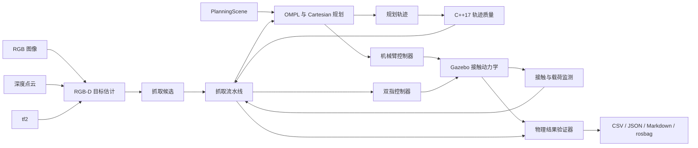

[](README.md) [](README.zh-CN.md)
[](https://github.com/0216Feng/panda-rgbd-manipulation/actions/workflows/ros2-ci.yml)

# Panda RGB-D 机械臂抓取系统

这是一个基于 ROS2 Jazzy、MoveIt2、ros2_control 与 Gazebo Harmonic 的可复现 Franka Panda 碰撞感知抓取项目。系统覆盖 RGB-D 目标定位、抓取位姿生成、OMPL 全局规划、接触区 Cartesian 运动、双指物理抓取、失败恢复和独立物理结果验证。

本仓库定位为机械臂运动规划岗位的仿真作品集，不代表已完成真机部署或工业安全认证。

## 项目亮点

- 基于 RGB 分割与深度聚类的无标记 RGB-D 目标定位。
- 使用 PlanningScene 表达碰撞几何，支持 RRTConnect、PRM 与 RRTstar。
- OMPL 与 Cartesian 混合执行，并基于实测关节状态重规划。
- 经 gtest 验证的 C++17 轨迹质量观察节点，在线统计路径长度、平滑度、关节步长与归一化关节限位裕度。
- 独立的机械臂控制器与双指同步 ros2_control 控制器。
- Gazebo 接触抓取、载荷漂移监测、直立放置、撤离和回原位验证。
- 静态/动态障碍实验、结构化失败原因、CSV/JSON/Markdown 报告、rosbag 与源码/配置指纹。
- Docker、devcontainer 和 GitHub Actions 软件检查。

## 实际运行效果

下图来自当前源码在 fresh-world Gazebo Harmonic 中运行的一次 RGB-D 障碍抓取。RViz 展示由接触仿真驱动的实时状态，不是预录动画或真机画面。

| 抓取前场景与目标估计 | 物理夹取与抬升 | 碰撞感知转运轨迹 |
| --- | --- | --- |
|  |  |  |


该次采集通过独立物理验证：抬升 `0.126 m`、放置误差 `4.1 mm`、最终倾角 `0.00 deg`，并确认直线路径被障碍阻断。完整命令与来源见[演示素材说明](docs/assets/demo/README.zh-CN.md)。

### Gazebo 物理抓取与放置

[](docs/assets/demo/gazebo_obstacle_pick.mp4?raw=1)

完整 38.2 秒预览会在 GitHub README 中直接播放；点击画面可打开原始 960x540 H.264 视频。

该 Gazebo 对面视角覆盖抓取前接近、物理抬升、避障转运、直立释放、撤离和回原位。验证器测得最大抬升 `0.457 m`、放置误差 `11.5 mm`、最终倾角 `0.00 deg`，并确认碰撞感知直线路径受阻。视频为完整 76.2 秒相机流的 2 倍速播放，没有删减任务阶段；它是 Gazebo 仿真画面，不是真机视频。

### 故障注入安全停止

[](docs/assets/demo/gazebo_safe_stop.mp4?raw=1)

完整 13.8 秒预览同样会在首页直接播放；点击画面可打开原始 H.264 视频。

这段独立的 13.8 秒 H.264 视频展示一次预期内的安全失败：系统在 Servo 下降阶段受到 `16 N`、`100 ms` 的有界 Gazebo wrench 扰动，载荷/接触 watchdog 在 `107.8 ms` 内停止对应阶段并发布零指令，低于 `200 ms` 门槛。抓取流水线正确返回 `FAILED`，严格独立判定为 `SAFE_STOP_PASS`。证据见[源码绑定报告](artifacts/baselines/v1_candidate_20260913/safe_stop_video/README.md)。

## 系统架构



详见[架构说明](docs/architecture.zh-CN.md)。

## 实验证据

最终 `v1.0` 验收矩阵基于同一冻结源码快照（`2fa0440`），每轮均启动全新的 Gazebo world，所有尝试都保留在分母中。

| 证据集 | 结果 | 能够证明的内容 |
| --- | ---: | --- |
| 最终固定 RGB-D | 10/10（100%） | 无标记感知与物理抓放的重复性 |
| 最终固定种子随机 RGB-D | 20/20（100%） | 目标位置变化；平均感知误差 `1.29 mm` |
| 最终代表性障碍 | 3/3（100%） | 三类障碍直线路径均受阻，并完成碰撞感知转运 |
| 最终 Gazebo wrench 安全停止 | 1/1 | 注入 `16 N`、`100 ms` 扰动后 `171.21 ms` 停止，低于 `200 ms` 门槛 |

固定、随机、障碍三个成功 cohort 的平均感知误差分别为 `0.55/1.29/2.49 mm`，平均放置误差分别为 `1.74/2.35/4.02 mm`。软件回归 `318/318` 通过，所有物理 cohort 的源码指纹一致。

此前的 90 轮三规划器对比和 5 组空载/负载配对实验保留为补充证据；它们有独立版本边界，不与最终验收矩阵合并统计。

- [最终 v1.0 证据与方法](artifacts/baselines/v1.0.0/README.zh-CN.md)
- [最终机器可读判定](artifacts/baselines/v1.0.0/release_summary.json)
- [归档 90 轮障碍实验](artifacts/baselines/gazebo_obstacle_90_trials.md)
- [补充配对载荷报告](artifacts/baselines/v1_candidate_20260910/payload_transfer_paired5/report.md)
- [发布状态与对外表述边界](docs/github_release_readiness.zh-CN.md)


## 快速开始

支持 Ubuntu 24.04 或 WSL2 Ubuntu 24.04 + ROS2 Jazzy。请在仓库根目录执行：

```bash
source /opt/ros/jazzy/setup.bash
WORKSPACE_DIR="$PWD" bash scripts/setup_wsl_ros2_jazzy.sh
source install/setup.bash
SKIP_PHYSICAL=1 bash scripts/run_release_candidate_validation.sh
bash scripts/run_rgbd_markerless_pick.sh
```

最后一条命令启动 RGB-D 抓取演示。WSL2 需要启用 WSLg 才能显示 RViz/Gazebo。安装脚本不会修改 shell 启动文件。

仅检查已安装 ROS 节点图：

```bash
python3 scripts/check_ros_graph_smoke.py --timeout-s 45
```

持续显示 RGB-D 点云：

```bash
bash scripts/run_rgbd_visualization.sh
```

执行一次 fresh-world 物理 benchmark：

```bash
mkdir -p artifacts/runs/rgbd_smoke
python3 scripts/run_gazebo_physics_benchmark.py \
  --trials 1 --rgbd-perception --timeout-s 300 \
  --csv artifacts/runs/rgbd_smoke/results.csv \
  --markdown artifacts/runs/rgbd_smoke/report.md \
  --log-dir artifacts/runs/rgbd_smoke/logs
```

原生环境、Docker、devcontainer 与 CI 步骤见[复现指南](docs/reproduction.zh-CN.md)。冻结干净 commit 后，可运行完整 `v1.0` 物理发布门禁：

```bash
bash scripts/run_v1_release_validation.sh
```

修改发布基础设施时先使用 `V1_PROFILE=smoke`。smoke 只验证 runner，不能作为 `v1.0` 可靠性结论。

## 演示与评测

推荐依次录制无标记 RGB-D 抓取、静态障碍与安全停止注入，完整脚本见[演示指南](docs/demo_script.zh-CN.md)。图表可通过以下命令更新并检查是否与数据一致：

```bash
python3 scripts/generate_portfolio_assets.py
python3 scripts/generate_portfolio_assets.py --check
bash scripts/run_gazebo_camera_video.sh
```

主要 benchmark 入口：

```bash
# 固定与随机 RGB-D 物理实验
python3 scripts/run_gazebo_physics_benchmark.py --trials 10 --rgbd-perception
python3 scripts/run_gazebo_physics_benchmark.py \
  --trials 20 --rgbd-perception --randomize-target --seed 42

# 静态障碍规划器/场景矩阵
python3 scripts/run_gazebo_physics_benchmark.py \
  --trials 3 --challenge-obstacles --planner-suite

# 动态 RGB-D 障碍取消与重规划
python3 scripts/run_dynamic_replanning_benchmark.py \
  --trials 3 --planner-suite --scenario-suite --timeout-s 240

# 匹配的空载/负载转运诊断
python3 scripts/run_payload_transfer_diagnostics.py \
  --runs-per-mode 5 --modes unloaded loaded \
  --output-dir artifacts/runs/payload_transfer_paired5
```

## 仓库结构

```text
.
|-- src/panda_manipulation/   # Python ROS2 主流程、launch、配置与测试
|-- src/panda_manipulation_cpp/ # C++17 轨迹质量库、节点与 gtest
|-- scripts/                  # 安装、smoke test 与实验 runner
|-- artifacts/baselines/      # 可公开的精简数据、报告和配置证据
|-- docs/                     # 架构、验证和技术路线图
|-- Dockerfile
`-- .github/workflows/ros2-ci.yml
```

## 验证边界

当前开发树在维护者 ROS2 Jazzy 环境中通过 colcon 汇总的 `329` 项测试。已安装节点图 smoke 还会发布合成 `DisplayTrajectory`，并校验 C++17 `/trajectory_quality_metrics` 输出。GitHub Actions 构建 Docker 镜像、测试两个 ROS 包并重复节点图检查；这些当前开发树结果与上文冻结版本的 `318/318` 验收证据分开统计。

Gazebo 目标真值与接触数据目前参与在线载荷监测、有界纠偏和最终评分。RGB-D 提供目标估计，但系统因此不是纯视觉控制器。目标检测采用颜色/聚类方法，并非任意物体 6D 位姿估计器。

当前限制：

- 仅完成仿真，无真机驱动、手眼标定或硬件安全论证。
- 任务编排与 MoveIt 执行仍为 Python；首个 C++17 边界目前仅做观测，不拥有控制指令权限。
- 接触效果依赖 Gazebo 物理参数、摩擦和控制器调参。
- MoveIt Servo 为可选实验下降后端；当前发布证据使用 Cartesian path。

真机迁移、C++ 执行、标定和力控规划见[长期路线图](docs/roadmap.zh-CN.md)。

## 文档

- [中文文档索引](docs/README.zh-CN.md)
- [架构说明](docs/architecture.zh-CN.md)
- [复现与 CI](docs/reproduction.zh-CN.md)
- [演示与录制](docs/demo_script.zh-CN.md)
- [发布检查](docs/github_release_readiness.zh-CN.md)
- [长期路线图](docs/roadmap.zh-CN.md)
- [C++ 轨迹观察节点 ADR](docs/adr/0001-cpp-trajectory-quality-observer.zh-CN.md)

## 许可证

项目原创代码与文档采用 MIT License。基于 MoveIt Resources 修改的 Panda 模型仍遵循 Apache-2.0，详见 [THIRD_PARTY_NOTICES.md](THIRD_PARTY_NOTICES.md) 与 [LICENSES/Apache-2.0.txt](LICENSES/Apache-2.0.txt)。
