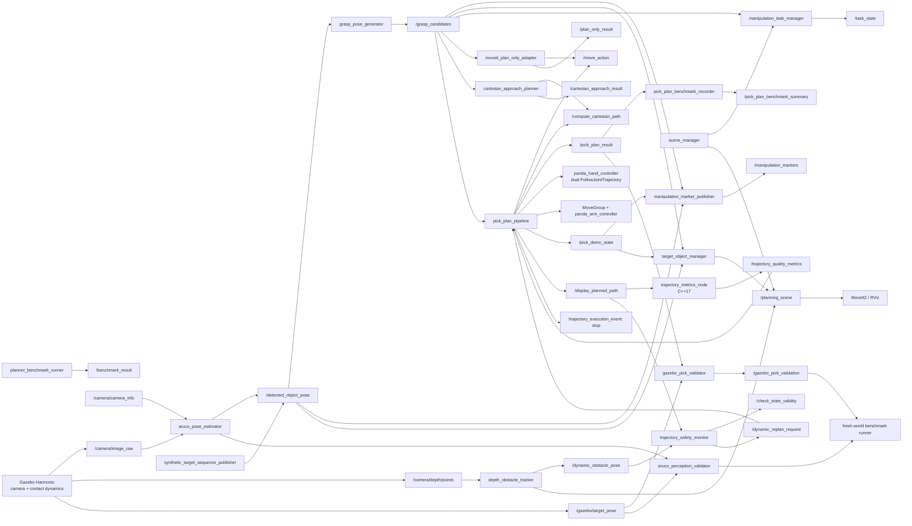

 

# Architecture

## Data Flow

## Module Responsibilities

- `scene_manager`: owns the simulated table, objects, obstacle descriptions, and publishes MoveIt2 planning scene diffs.
- `aruco_pose_estimator`: detects the ArUco target and publishes its pose in the robot base frame.
- `grasp_pose_generator`: generates pre-grasp, grasp, lift, place, and retreat poses from a target pose.
- `manipulation_marker_publisher`: publishes target, waypoint, and demo-state markers for RViz showcase.
- `target_object_manager`: experimental module that converts the target between a world collision object, an attached object on `panda_hand`, and a released object at `place_pose`.
- `manipulation_task_manager`: runs the pick-and-place state machine and centralizes retry/error reporting.
- `moveit_plan_only_adapter`: sends selected grasp candidate poses to MoveIt2 `MoveGroup` as plan-only requests.
- `cartesian_approach_planner`: computes a straight Cartesian approach from pre-grasp to grasp using MoveIt2.
- `pick_plan_pipeline`: runs the hybrid OMPL/Cartesian pick sequence, executes the arm and two physical finger joints, manages target collision attachment, performs probe-lift validation, and applies bounded recovery from target motion or finger contact asymmetry.
- `synthetic_target_sequence_publisher`: publishes repeatable benchmark target poses.
- `pick_plan_benchmark_recorder`: records pick pipeline results and writes CSV/Markdown metrics.
- `planner_benchmark_runner`: runs repeatable planner comparisons and exports metrics.
- `aruco_perception_validator`: compares camera-derived target poses with Gazebo ground truth and reports error, latency, and detection rate.
- `gazebo_pick_validator`: accepts a task only when Gazebo measurements verify physical lift, placement error, upright orientation, and return-home completion.
- `run_gazebo_physics_benchmark.py`: launches each trial in a fresh world, builds planner/scenario/perception matrices, separates startup failures from task failures, and exports CSV/Markdown/SVG reports.
- `depth_obstacle_tracker`: clusters the Gazebo RGB-D point cloud, transforms detections into `panda_link0`, applies directional collision padding, and owns the sensed dynamic PlanningScene object.
- `dynamic_obstacle_controller`: moves the obstacle across the active workspace and halts it when the trajectory safety monitor raises a hazard.
- `trajectory_safety_monitor`: samples the remaining states of active OMPL trajectories, calls MoveIt's state-validity service, and requests cancellation when a newly sensed obstacle invalidates the path.
- `trajectory_metrics_node`: a C++17 read-only observer that measures each
  `DisplayTrajectory` segment and publishes path length, joint step, velocity,
  acceleration, smoothness, tortuosity, terminal state, and joint-limit-margin
  metrics. The pick result and fresh-world benchmark retain its aggregates.
- `dynamic_obstacle_perception_validator`: compares RGB-D obstacle estimates with Gazebo ground truth and reports position error, latency, and tracking span.
- `run_dynamic_replanning_benchmark.py`: builds planner x dynamic-scenario x repeat matrices in isolated worlds and exports per-trial CSV plus grouped Markdown/SVG statistics for perception, safety-check, cancellation, replanning, OMPL cost, and physical placement.

## Execution And Validation Boundary

MoveIt2 owns robot-state planning, collision checking, attached-object semantics, and OMPL/Cartesian trajectory generation. `ros2_control` executes the arm and both Panda finger joints in Gazebo. The Gazebo-specific robot description removes the unsupported physical mimic constraint while the MoveIt model retains Panda's original mimic semantics.

The C++ metrics package is deliberately outside the command path: it subscribes
to displayed trajectories and publishes diagnostics, but cannot plan, cancel,
or execute motion. This makes the first Python-to-C++ migration step measurable
without changing the validated manipulation behavior. Experiment source
fingerprints cover both ROS packages, so changing the observer invalidates an
incompatible benchmark checkpoint. See
[ADR 0001](adr/0001-cpp-trajectory-quality-observer.md).

Pipeline success alone is insufficient. The validator independently reads the simulated object's ground-truth pose and checks lift height, final placement error, upright orientation, and return-home. Challenge trials additionally compare collision-disabled and collision-aware Cartesian direct paths before OMPL execution, so an avoidance success requires measured obstruction plus a physically validated alternative trajectory.

For dynamic trials, the initial path is planned while the obstacle is outside
the path. The obstacle then crosses the workspace during execution. A trial is
accepted only if the RGB-D estimate updates the PlanningScene, the remaining
trajectory is proven invalid, MoveIt reports cancellation, a fresh path is
planned from measured joints, and Gazebo independently verifies the final
physical pick-and-place result.

The dynamic runner separates an intermediate alignment waypoint from the
contact approach safety boundary. After an elevated collision-aware recovery,
a checked alignment prefix may be executed once it reaches 90% of the staging
motion, while the subsequent contact approach, lift, place descent, and retreat
still require at least 98% Cartesian completion. Gripper goals rejected during
the controller activation window are retried with a bounded delay; this startup
recovery is reported separately and never converts a failed physical grasp into
a success.

Benchmark reporting keeps two acceptance layers. `Physical task success`
requires a successful pipeline and independent Gazebo lift/place validation.
`Full evidence success` additionally requires the RGB-D validator's terminal
accuracy result and a trajectory-safety event. This prevents telemetry timing
gaps from being mislabeled as manipulation failures while preserving a strict
end-to-end metric for reproducibility.
