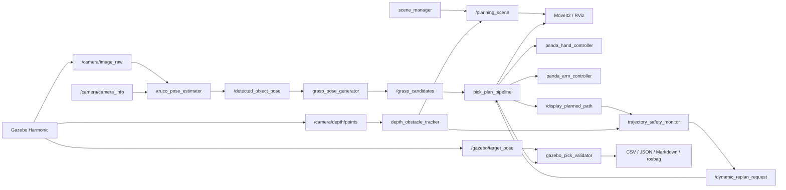

 

# 系统架构

## 数据流

完整 topic/action 关系见[英文架构图](architecture.md)，节点名与接口保持语言无关。

## 模块职责

- `scene_manager`：管理桌面、目标和障碍物描述，并发布 MoveIt2 PlanningScene diff。
- `aruco_pose_estimator`：检测 ArUco 目标，将位姿转换到机械臂基坐标系。
- `grasp_pose_generator`：从目标位姿生成 pre-grasp、grasp、lift、place 与 retreat 候选。
- `manipulation_marker_publisher`：发布 RViz 中的目标、路径点和任务阶段 marker。
- `target_object_manager`：管理目标在世界碰撞物、`panda_hand` 附着物与释放物体之间的状态。
- `manipulation_task_manager`：执行抓取状态机并统一记录重试和错误。
- `moveit_plan_only_adapter`：向 MoveGroup 发送仅规划请求。
- `cartesian_approach_planner`：计算 pre-grasp 到 grasp 的直线 Cartesian 接近。
- `pick_plan_pipeline`：组合 OMPL/Cartesian 路径、机械臂与双指执行、碰撞附着、探测抬升和有界恢复。
- `aruco_perception_validator`：将视觉位姿与 Gazebo 真值比较，输出误差、延迟与检测率。
- `gazebo_pick_validator`：只有在抬升、放置误差、倾角和回原位均通过时才接受任务。
- `run_gazebo_physics_benchmark.py`：每轮启动独立世界，构造规划器/场景/感知矩阵并导出报告。
- `depth_obstacle_tracker`：聚类 RGB-D 点云，转换到 `panda_link0`，加入方向性安全余量并更新感知障碍物。
- `trajectory_safety_monitor`：采样剩余轨迹，通过 `/check_state_validity` 检查状态，在新障碍使路径失效时请求取消。
- `run_dynamic_replanning_benchmark.py`：运行规划器、动态场景与重复次数矩阵，记录感知、停止、重规划、轨迹代价和物理结果。

## 执行与验证边界

MoveIt2 负责机器人状态、碰撞检查、attached object 语义以及 OMPL/Cartesian 轨迹生成；ros2_control 在 Gazebo 中执行七轴机械臂与两根手指。Gazebo 专用模型移除了物理引擎不支持的 mimic constraint，而 MoveIt 模型仍保留 Panda 的 mimic 语义。

流水线报告 `SUCCESS` 并不足以通过验收。独立验证器读取物体真值，检查实际抬升高度、最终放置误差、直立姿态和回原位。障碍实验还对比关闭碰撞与开启碰撞的直线路径，只有“直线路径确实受阻，并由替代轨迹完成物理任务”才计为避障成功。

动态实验先在障碍位于路径外时规划，随后让障碍横穿工作区。验收要求 RGB-D 更新 PlanningScene、剩余轨迹被证明无效、MoveIt 确认取消、系统从实测关节状态重规划，最后由 Gazebo 独立确认物理抓取放置结果。

报告保留两层成功定义：`Physical task success` 要求流水线与 Gazebo 抬升/放置验证均通过；`Full evidence success` 还要求 RGB-D 终态精度与轨迹安全事件齐全。这样既不会把遥测时序缺口误认为操作失败，也保留严格的端到端复现指标。
