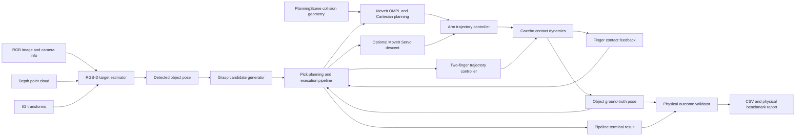

# Release Architecture

This page describes the current RGB-D physical pipeline. Historical ArUco,
plan-only and synthetic demos remain available, but use different inputs and
validation scopes. The implementation is primarily Python with ROS2 interfaces.

## What the visual input provides

`rgbd_target_pose_estimator` subscribes to `/camera/image_raw`,
`/camera/camera_info` and `/camera/depth/points`, combines red-object segmentation
with depth clusters, and publishes `/detected_object_pose`. This profile assumes
a target with the expected appearance and a calibrated simulated camera. It is
not an unknown-object recognition system or a general 6D pose estimator.

`grasp_pose_generator` converts the target estimate into candidate approach,
grasp, lift and placement waypoints. `pick_plan_pipeline` owns the physical
execution sequence. The older `manipulation_task_manager` dry-run node is a ROS
wiring demo and is not the Gazebo physical execution implementation.

## Planning and execution

The current RGB-D release profile uses the RRTConnect/PRM/RRTstar fallback chain
and Cartesian descent. The visualization entry now inherits those parent launch
defaults. Planner comparisons must explicitly select one planner; fallback-chain
success is not an individual planner's success rate.

MoveIt Servo is an optional short-descent backend with separate paired and fault
injection evidence. Results obtained with Cartesian descent do not validate the
Servo backend. Both branches use measured joint state and existing collision and
contact checks. Physics-based grasping uses the two finger controllers and Gazebo
contact dynamics; MoveIt attached-object bookkeeping alone does not move the
physical object.

## Ground-truth dependencies

The pipeline also subscribes to `/gazebo/target_pose` and simulated contact
feedback. These inputs participate in probe-lift verification, relative payload
drift checks, placement feedback and bounded corrections. Ground truth therefore
affects online execution decisions as well as final scoring.

`gazebo_pick_validator` checks object lift, final position and upright orientation
alongside the pipeline outcome. Passing this validator establishes a simulated
physical outcome. It does not establish independence from simulation truth or
successful transfer to hardware.

For hardware migration, replace truth-dependent observations with measured
object tracking, calibrated TCP/hand transforms and appropriate contact sensing;
then repeat the same outcome and failure tests on that sensing configuration.

## Evidence scopes

| Evidence | What it demonstrates |
| --- | --- |
| Software tests | Covered functions, models and error handling |
| Synthetic ROS smoke | Installed topic chain and task-state publication |
| Plan-only benchmark | Accepted planning results under its configured checks |
| RGB-D physical benchmark | This perception profile plus simulated execution and outcome checks |
| Static challenge | Direct-path obstruction and the tested alternative motion |
| Dynamic replanning | Sensed scene update, cancellation and replanning in the recorded cases |
| Servo disturbance experiment | Matched-stage detection and zero-command response to the specified injection |

Zero-command latency is measured separately from physical stopping distance and
payload retention. A successful fault-response test may intentionally finish the
pick task in FAILED state. Counts, configuration and source identity must accompany
each claim; see the release plan and dated validation reports.
